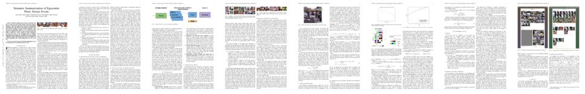
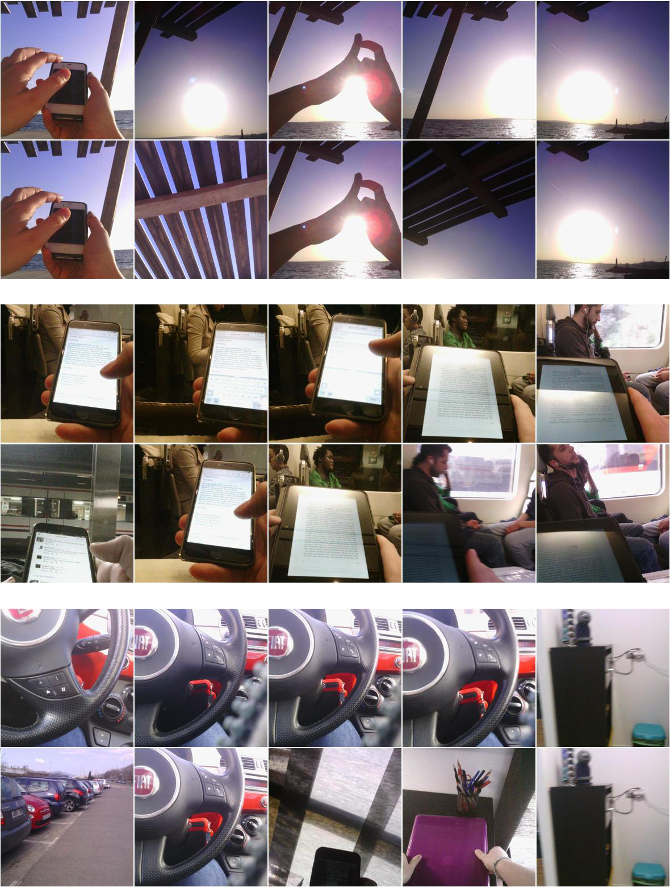

# Semantic Summarization of Egocentric Photo Stream Events

| ![Xavier Giro-i-Nieto][XavierGiro-photo]  | ![Aniol Lidon][AniolLidon-photo]  | ![Marc Bolaños][MarcBolanos-photo] | ![Marc Carne][MarcCarne-photo] |  ![Mariella Dimiccoli][MariellaDimiccoli-photo] |  ![Petia Radeva][PetiaRadeva-photo]  |
|:-:|:-:|:-:|:-:|:-:|:-:|
| [Xavier Giro-i-Nieto][XavierGiro-web]  | Aniol Lidon  | [Marc Bolaños][MarcBolanos-web] | Marc Carné |  [Mariella Dimiccoli][MariellaDimiccoli-web]  | [Petia Radeva][PetiaRadeva-web]    |

[XavierGiro-photo]: ./authors/XavierGiro.jpg "Xavier Giro-i-Nieto"
[AniolLidon-photo]: ./authors/AnioLidon.jpg "Aniol Lidon"
[MarcBolanos-photo]: ./authors/MarcBolanos.jpg "Marc Bolaños"
[MarcCarne-photo]: ./authors/MarcCarne.jpg "Marc Carné"
[MariellaDimiccoli-photo]: ./authors/MariellaDimiccoli.jpg "Mariella Dimmicoli"
[PetiaRadeva-photo]: ./authors/PetiaRadeva.jpg "Petia Radeva"

[XavierGiro-web]: https://imatge.upc.edu/web/people/xavier-giro
[MarcBolanos-web]: http://www.ub.edu/cvub/member/marc-bolanos/
[MariellaDimiccoli-web]: http://www.ub.edu/bcnpcl/marielladimiccoli/index.html
[PetiaRadeva-web]: http://www.cvc.uab.es/~petia/


A joint collaboration between:

| ![logo-upc] | ![logo-ub] |
|:-:|:-:|
| [Image Processing Group at the Universitat Politecnica de Catalunya (UPC)][gpi-web] | [Computer Vision Group at Universitat de Barcelona (UB)][cvub-web] | 

[gpi-web]: https://imatge.upc.edu/web/ 
[cvub-web]: http://www.ub.edu/cvub/

[logo-upc]: ./logos/upc.jpg "Universitat Politecnica de Catalunya"
[logo-ub]: ./logos/ub.png "Universitat de Barcelona"


## Abstract

With the rapid increase of users of wearable cameras in recent years and of the amount of data they produce, there is a strong need for automatic retrieval and summarization techniques. This work addresses the problem of automatically summarizing egocentric photo streams captured through a wearable camera by taking an image retrieval perspective. After removing non-informative images by a new CNN-based filter, images are ranked by relevance to ensure semantic diversity and finally re-ranked by a novelty criterion to reduce redundancy. To assess the results, a new evaluation metric is proposed which takes into account the non-uniqueness of the solution. Experimental results applied on a database of 7,110 images from 6 different subjects and evaluated by experts gave 95.74% of experts satisfaction and a Mean Opinion Score of 4.57 out of 5.0.

## Publication

An [arXiv pre-print](http://arxiv.org/abs/1511.00438) is already available. 



Please cite with the following Bibtex code:

````
@article{lidon2015semantic,
  title={Semantic Summarization of Egocentric Photo Stream Events},
  author={Lidon, Aniol and Bola{\~n}os, Marc and Dimiccoli, Mariella and Radeva, Petia and Garolera, Maite and Gir{\'o}-i-Nieto, Xavier},
  journal={arXiv preprint arXiv:1511.00438},
  year={2015}
}
```

You may also want to refer to our publication with the more human-friendly Chicago style:

*Lidon, Aniol, Marc Bolaños, Mariella Dimiccoli, Petia Radeva, Maite Garolera, and Xavier Giró-i-Nieto. "Semantic Summarization of Egocentric Photo Stream Events." arXiv preprint arXiv:1511.00438 (2015).*

This work is an extension of the [master thesis](https://imatge.upc.edu/web/publications/semantic-and-diverse-summarization-egocentric-photo-events) by Aniol Lidon for the [Master in Computer Vision Barcelona](http://pagines.uab.cat/mcv/), class of 2015.


## Visual Results

Three examples of the top 5 images obtained before introducing diversity (uneven rows) and after introducing it (even rows).




## Acknowledgements

We would like to especially thank Albert Gil Moreno and Josep Pujal from our technical support team at the Image Processing Group at the UPC.

| ![AlbertGil-photo]  | ![JosepPujal-photo]  |
|:-:|:-:|
| [Albert Gil](AlbertGil-web)  |  [Josep Pujal](JosepPujal-web) |

[AlbertGil-photo]: ./authors/AlbertGil.jpg "Albert Gil"
[JosepPujal-photo]: ./authors/JosepPujal.jpg "Josep Pujal"

[AlbertGil-web]: https://imatge.upc.edu/web/people/albert-gil-moreno
[JosepPujal-web]: https://imatge.upc.edu/web/people/josep-pujal

This work was partially founded by the projects TEC2013-43935-R and TIN2012-38187-C03-01 founded by MEC, Spain
and SGR1219 and SGR1421 founded by AGAUR, Catalunya, Spain. M. Dimiccoli is supported by a Beatriu de Pinos` grant (Marie-Curie COFUND action). 

|   |   |
|:--|:-:|
|  We gratefully acknowledge the support of [NVIDIA Corporation](http://www.nvidia.com/content/global/global.php) with the donation of the GeoForce GTX [Titan Z](http://www.nvidia.com/gtx-700-graphics-cards/gtx-titan-z/) and [Titan X](http://www.geforce.com/hardware/desktop-gpus/geforce-gtx-titan-x) used in this work. |  ![logo-nvidia] |
|  The Image ProcessingGroup at UPC (SGR1421) and the Computer Vision Group at UB (SGR1219) are Consolidated Research Groups recognized and sponsored by the Catalan Government (Generalitat de Catalunya) through its [AGAUR](http://agaur.gencat.cat/en/inici/index.html) office. Mariella Dimiccoli is supported by a Beatriu de Pinos grant, Marie-Curie COFUND action. |  ![logo-catalonia] |
|  This work has been developed in the framework of the project [BigGraph TEC2013-43935-R](https://imatge.upc.edu/web/projects/biggraph-heterogeneous-information-and-graph-signal-processing-big-data-era-application) and and TIN2012-38187-C03-01, funded by the Spanish Ministerio de Economía y Competitividad and the European Regional Development Fund (ERDF).  | ![logo-spain] | 

[logo-nvidia]: ./logos/nvidia.jpg "Logo of NVidia"
[logo-catalonia]: ./logos/generalitat.jpg "Logo of Catalan government"
[logo-spain]: ./logos/MEyC.png "Logo of Spanish government"

## Contact

If you have any general doubt about our work or code which may be of interest for other researchers, please use the [issues](https://github.com/imatge-upc/egocentric-2015-thms/issues) section on this github repo. Alternatively, drop us an e-mail at <mailto:xavier.giro@upc.edu>.

<!---
Javascript code to enable Google Analytics
-->

<script>

  (function(i,s,o,g,r,a,m){i['GoogleAnalyticsObject']=r;i[r]=i[r]||function(){
  (i[r].q=i[r].q||[]).push(arguments)},i[r].l=1*new Date();a=s.createElement(o),
  m=s.getElementsByTagName(o)[0];a.async=1;a.src=g;m.parentNode.insertBefore(a,m)
  })(window,document,'script','//www.google-analytics.com/analytics.js','ga');

  ga('create', 'UA-7678045-3', 'auto');
  ga('send', 'pageview');

</script>
